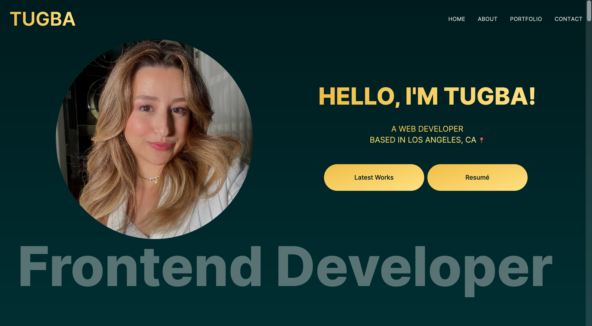
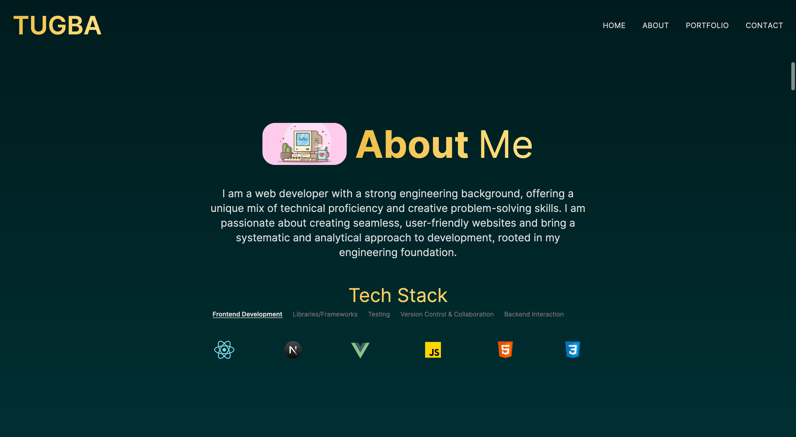
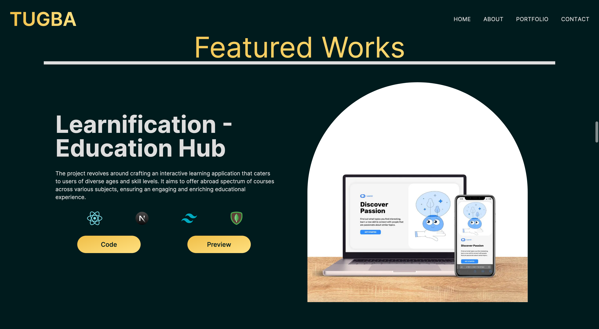
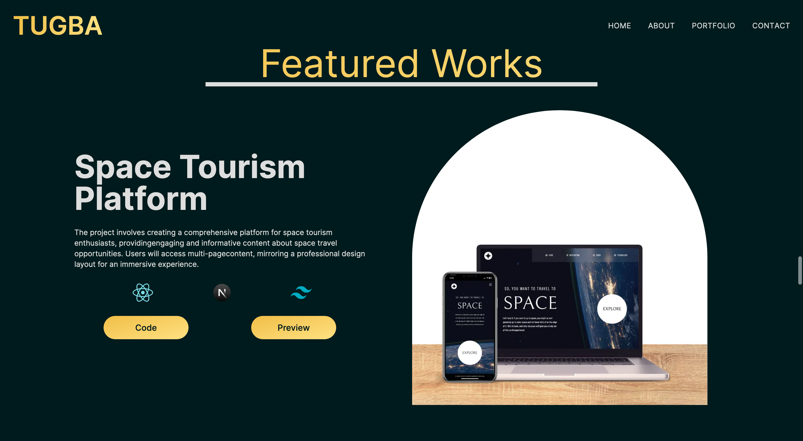
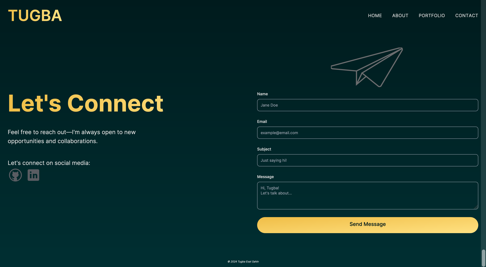

# Personal Portfolio Showcase - Tugba's Website

This project entails the development of a personal portfolio website, serving as a showcase for my professional journey. It offers a glimpse into my skills, projects, and contact information. 

This personal portfolio website serves as a showcase of my skills, projects, and professional journey, providing a comprehensive overview for anyone interested in learning more about me.

## Live Demo of the Project: 📹

- Live Project URL: [Portfolio Website](https://tugbaesatsahin.vercel.app/)

## Technologies, Frameworks and Libraries: ☕️ 🐍 ⚛️

- **Frontend:** Next.js, React, Material-UI, Framer Motion, and React Type Animation for dynamic and visually appealing elements.

- **Styling:** Utilized Tailwind CSS for a sleek and responsive design.

- **Communication:** Integrated EmailJS for streamlined communication methods.

[Next.js](https://nextjs.org/)
[React](https://react.dev/)
[Tailwind CSS](https://tailwindcss.com/)
[Material-UI](https://mui.com/material-ui/)
[Framer Motion](https://www.framer.com/motion/)
[EmailJS](https://www.emailjs.com/)

## Project Properties: 🚀

- **Dynamic Web Design:** Developed a dynamic and responsive website using Next.js, React, and Material-UI for an engaging user experience.

- **Visual Dynamism:** Incorporated Framer Motion and React Type Animation for visually dynamic elements and effects.

- **Communication Efficiency:** Utilized Resend to facilitate streamlined communication methods for efficient interactions.

- **Technology Stack:** Embraced the latest technologies, including Next.js, React, Material-UI, Framer Motion, and React Type Animation.

- **Responsive Design:** Ensured a sleek and responsive design through the use of Tailwind CSS, providing an optimal viewing experience on various devices.

## Screenshots: 📷

### Hero Section

### About Section

### Portfolio Section

### Contact Section

## Authors: 💻
- Website - [Tugba Esat Sahin](https://tugbaesatsahin.vercel.app)
- GitHub - [@tugbaesat](https://github.com/tugbaesat)

